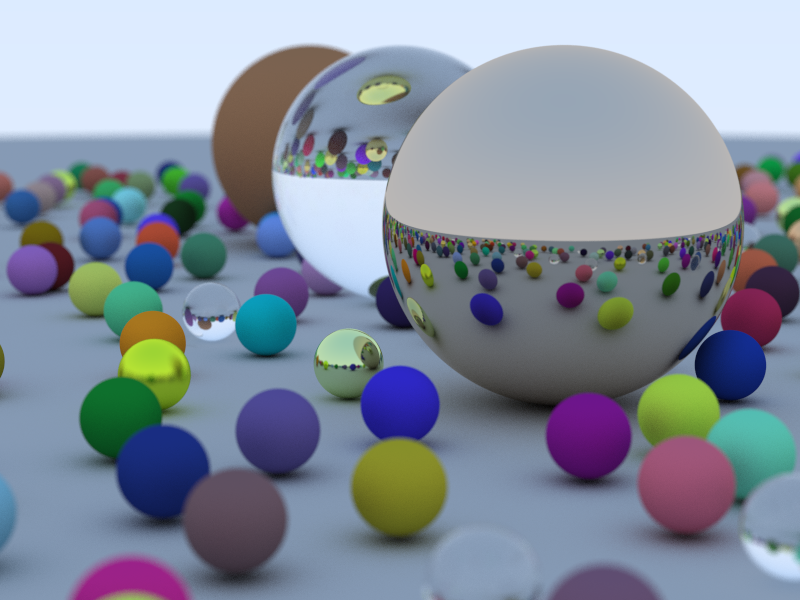

# Ray Tracing
 


 

A simple ray tracer implementation based on ray-object intersection calculations, material properties, and camera simulation.
 


 


 


 

## Overview
 


 

This ray tracer implements a physically-based rendering approach that simulates the behavior of light in a 3D environment. The code is designed around several key components:
 


 

### Key Components
 


 

1. **Vectors (`vec3.h`)**: A fundamental 3D vector class for all spatial calculations
 

2. **Rays (`ray.h`)**: Defines rays that are cast from the camera into the scene
 

3. **Hitables (`hitable.h`)**: Abstract base class for objects that can be intersected by rays
 

4. **Materials**: Implementations of different material types:
 

   - Lambertian (diffuse)
 

   - Metal (reflective with optional fuzz)
 

   - Dielectric (glass-like with refraction)
 

5. **Camera (`camera.h`)**: Simulates a camera with position, orientation, and depth of field
 


 

## How Ray Tracing Works
 


 

Ray tracing works by simulating the physical behavior of light in reverse:
 


 

1. **Ray Generation**: Rays are generated from the camera position through each pixel in the image plane
 

   ```cpp
 

   ray r = cam.get_ray(u, v);
 

   ```
 


 

2. **Ray-Object Intersection**: Rays are tested for intersection with scene objects
 

   ```cpp
 

   if (world->hit(r, 0.001, MAXFLOAT, rec)) {
 

       // Handle hit
 

   }
 

   ```
 


 

3. **Material Interaction**: When a ray hits an object, the material determines how the ray interacts
 

   ```cpp
 

   if (rec.mat_ptr->scatter(r, rec, attenuation, scattered)) {
 

       return attenuation*color(scattered, world, depth+1);
 

   }
 

   ```
 


 

4. **Recursive Rendering**: Rays can be reflected, refracted, or absorbed based on material properties
 

   ```cpp
 

   // Recursive call for reflection/refraction
 

   return attenuation*color(scattered, world, depth+1);
 

   ```
 


 

5. **Background Color**: Rays that don't hit any object return a background color (gradient)
 

   ```cpp
 

   vec3 unit_direction = unit_vector(r.direction());
 

   float t = 0.5*(unit_direction.y() + 1.0);
 

   return (1.0-t)*vec3(1.0, 1.0, 1.0) + t*vec3(0.5, 0.7, 1.0);
 

   ```
 


 

## Running the Code
 


 

To compile and run the ray tracer:
 


 

```bash
 

# Compile the code
 

g++ -std=c++11 main.cpp -o raytracer
 


 

# Run and output to PPM image file
 

./raytracer > output.ppm
 

```
 


 

The output is in PPM format, which can be viewed with most image viewers or converted to other formats using tools like ImageMagick:
 


 

```bash
 

# Convert to PNG using ImageMagick
 

convert output.ppm output.png
 

```
 


 

## Features
 


 

- **Depth of Field**: Simulated with aperture and focus distance parameters
 

- **Multiple Materials**: Diffuse, metal, and glass-like materials
 

- **Anti-aliasing**: Implemented through multiple samples per pixel
 

- **Random Scene Generation**: Capability to generate complex scenes with many objects
 


 

## Example Scene
 


 

The ray tracer can generate a random scene with hundreds of spheres:
 


 

```cpp
 

hitable *world = random_scene();
 

```
 


 

This creates a ground plane and multiple spheres with randomized materials and positions for an interesting render.
